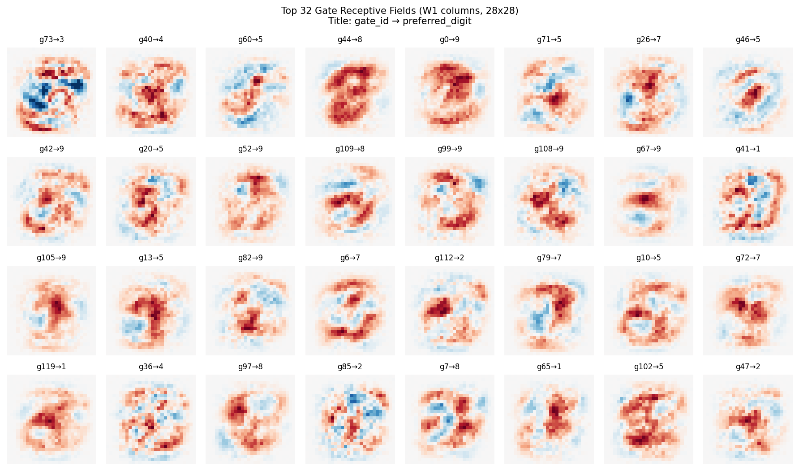
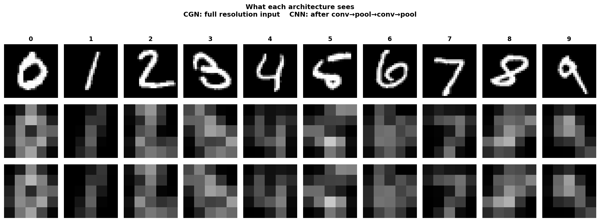

# River Learning

**A forward-only learning framework where current flow IS the explanation.**

> *"The path the current takes is the reasoning itself. There is no black box — only physics."*

## What is River Learning?

River Learning is a fundamentally different approach to neural network training. Instead of backpropagation, it uses **electrical circuit physics**: current flows through a network of resistances, carves paths where it flows most, and learns through inhibition (thresholding).

```
Traditional DL:  forward → compute loss → backward gradients → update weights
River Learning:  forward current → observe flow → carve paths → inhibit weak signals
```

### Core Principles

| Principle | Description |
|-----------|-------------|
| **Forward only** | No backward pass, no gradients. Current flows forward and that's all. |
| **Inhibition is intelligence** | Thresholds (thr) are the sole source of nonlinearity — equivalent to ReLU but learnable. |
| **The path IS the explanation** | Every prediction is a traceable flow of current. XAI is not post-hoc — it's the architecture. |
| **Structure from evolution, weights from experience** | Network topology is given (like genetics); conductance learning is individual experience. |

### Three Sources of Nonlinearity

| Mechanism | Role | Circuit Analogy |
|-----------|------|-----------------|
| **thr** (threshold) | Selective gating — weak signals blocked | Diode forward voltage |
| **flow_cap** | Capacity limit — forces path diversity | Wire current rating |
| **GND** (ground) | Excess current absorption — KCL conservation | Circuit ground |

## Architecture: Confluence Gate Network (CGN)

The network is built from **Gate Neurons**: multiple signals converge, sum, and fire above threshold.

```
h_j = max(0, Σ x_i · G_ij − thr_j)
```

Three matrices define the network:
- **C** (connectivity): which paths exist (0 or 1)
- **G** (conductance): how well current flows (learned)
- **thr** (threshold): per-edge gating (learned)

## Key Results

### MNIST (Paper 1-5)

| Configuration | Accuracy | Learning | Hardware | Time |
|---|---|---|---|---|
| CGN (h=128) | **90.4%** | Forward only | 1 CPU core | 35s |
| CGN (256→96 pruned) | **88.8%** | Forward only | 1 CPU core | 35s |

- No backpropagation, no GPU, no optimization tricks
- Self-compressing: 256 gates → 96 (62% pruned automatically)
- Every gate's receptive field is interpretable

### CIFAR-10 (Paper 6, in progress)

| Experiment | Accuracy | Key Finding |
|---|---|---|
| Best (bifurcation + GND) | **27.4%** | Node bifurcation at saturation = +2.6%p |
| Scale comparison | 5×5 > 10×10 > 20×20 | Smaller patches = more position diversity |
| Channel comparison | edge > lum > color | Brightness/edge most discriminative |

XAI-driven development: every experiment diagnosed through flow observation, not loss curves.

### Key Discoveries from CIFAR-10

1. **Linear distribution can't classify** — without thr, output direction is input-invariant (cos=1.0)
2. **thr = ReLU** — threshold gating is mathematically equivalent to activation functions
3. **Inhibition is intelligence** — proven: FC + linear middle layer = meaningless (0% pruning)
4. **Bifurcation** — saturated nodes split into specialized children (like cell division)
5. **XAI drives development** — flow analysis → diagnosis → structural fix (not post-hoc interpretation)

## Paper Series

1. **Forward-Only Path Carving Without Backpropagation** (Zenodo, 2026)
2. **Inference Is Learning: No Phase Separation** (Zenodo, 2026)
3. **One Gate, One Hundred Thousand Edges: Scaling to MNIST** (Zenodo, 2026)
4. **The Converged Structure Is the Explanation** (Zenodo, 2026)
5. **Confluence Gate Networks: From Biological Neuron to Standard Architecture** (Zenodo, 2026)
6. **XAI-Driven Development: Dissecting Deep Learning with Forward-Only Current Flow** (in progress)
7. Template Sharing and Network Design from Learning (upcoming)

## What's in this repo

- `scripts/verify_mnist.py` — Inference-only verification (MNIST)
- `scripts/visualize_gates.py` — Gate receptive field visualization
- `figures/` — Pre-generated visualizations
- `results/` — Training logs

## Verification

```bash
pip install numpy
python scripts/verify_mnist.py
```

## Visualizations

### Gate Receptive Fields
Each gate discovers its own spatial pattern from data — no filter shape prescribed.



### CGN vs CNN: What Each Architecture Sees
CNN reduces 28×28 to 5×5 (97% information loss). CGN sees the full image.



## Patent

Korean Patent Application **10-2026-0052624** (filed 2026). PCT filing planned.

## License

The checkpoint and inference scripts are provided for **verification and research purposes only**.
The training algorithm (River Learning) is proprietary and not included in this repository.

## Contact

Yeonseong Cynn — whitepep@gmail.com
