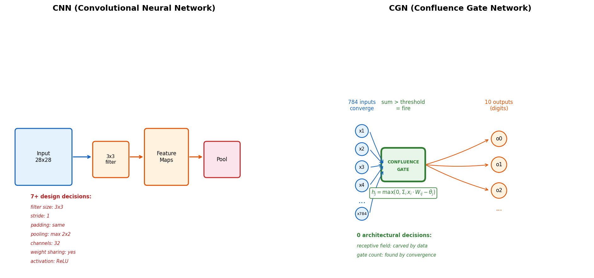
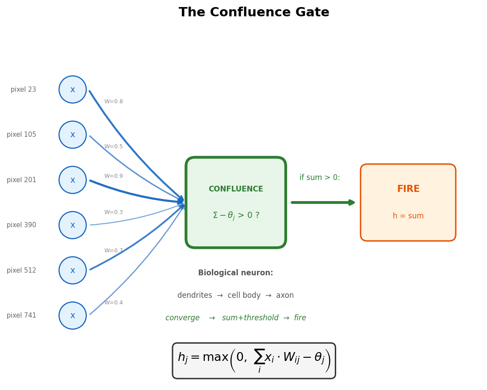

# CGN (Confluence Gate Network) — MNIST

**A new standard architecture built on Gate Neurons, trained without backpropagation.**

## What is CGN?

The **Confluence Gate Network (CGN)** is a network architecture built on a single primitive: the **Gate Neuron (GN)**.

```
h_j = max(0, Σ x_i · W_ij − θ_j)
```

Multiple signals converge, sum, and fire above threshold — the same operation as a biological neuron. No filter size, no stride, no pooling, no weight sharing. Zero architectural hyperparameters.

## Key Results on MNIST

| Configuration | Accuracy | Gates | Parameters | Backward Pass | Hardware | Time |
|---|---|---|---|---|---|---|
| CGN (h=128) | **90.4%** | 128 | 101,632 | **No** | 1 CPU core | 35s |
| CGN (256→96 pruned) | **88.8%** | 96 | 76,224 | **No** | 1 CPU core | 35s |

- **No backpropagation** — forward-only learning (River Learning)
- **No GPU** — single CPU core, 35 seconds
- **No optimization tricks** — no batch normalization, no data augmentation, no momentum
- **Self-compressing** — 256 gates automatically prune to 96 (62% removed)

## CNN vs CGN

| | CNN | CGN |
|---|---|---|
| Input information retained | ~3% (97% lost) | **100%** |
| Architectural decisions per layer | 7+ | **0** |
| Learning | Backward pass | **Forward only** |
| Interpretability | Post-hoc tools (SHAP, LIME) | **Read the weights** |
| Filter shape | Prescribed | **Discovered by data** |
| Gate count | Prescribed | **Found by convergence** |

## What's in this repo

- `checkpoint/` — Trained weights (W1, W2) for h=128 configuration
- `scripts/verify_mnist.py` — Inference-only verification script
- `scripts/visualize_gates.py` — Gate receptive field and vote visualization
- `scripts/compare_resolution.py` — CNN vs CGN resolution comparison
- `figures/` — Pre-generated visualizations
- `results/` — Training logs

## Verification

```bash
pip install numpy
python scripts/verify_mnist.py
```

Expected output: ~89.3% on the full 10K test set.

Note: The checkpoint was saved at a different epoch than the best test accuracy (90.4% at epoch 82).

## Visualizations

### Gate Receptive Fields
Each gate discovers its own spatial pattern from data — no filter shape prescribed.


### CNN vs CGN: What Each Architecture Sees
CNN reduces 28×28 to 5×5 (97% information loss). CGN sees the full image.


### CGN Architecture


### Gate Neuron Detail


## Paper Series

1. **Forward-Only Path Carving Without Backpropagation** (Zenodo, 2026)
2. **Inference Is Learning: No Phase Separation** (Zenodo, 2026)
3. **One Gate, One Hundred Thousand Edges: Scaling to MNIST** (Zenodo, 2026)
4. **The Converged Structure Is the Explanation** (Zenodo, 2026)
5. **Confluence Gate Networks: From Biological Neuron to Standard Architecture** (Zenodo, 2026)
6. Template Sharing and Network Design from Learning (upcoming)

## Patent

Korean Patent Application **10-2026-0052624** (filed 2026). PCT filing planned.

## License

The checkpoint and inference scripts are provided for **verification and research purposes only**.
The training algorithm (River Learning) is proprietary and not included in this repository.

## Contact

Yeonseong Cynn — whitepep@gmail.com
